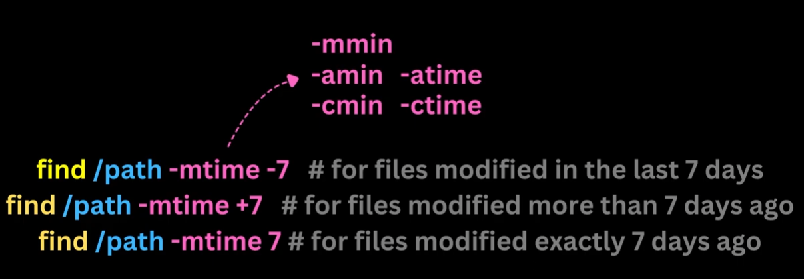
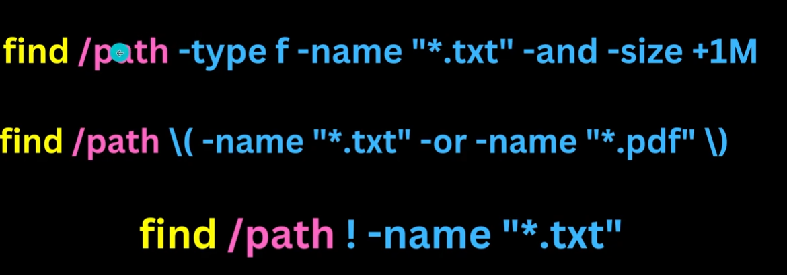
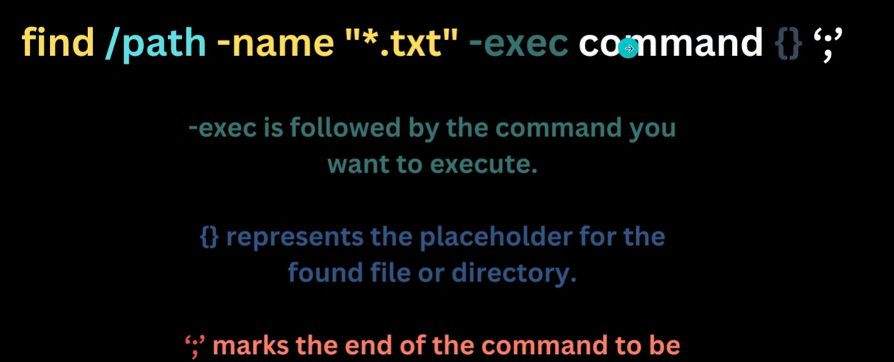
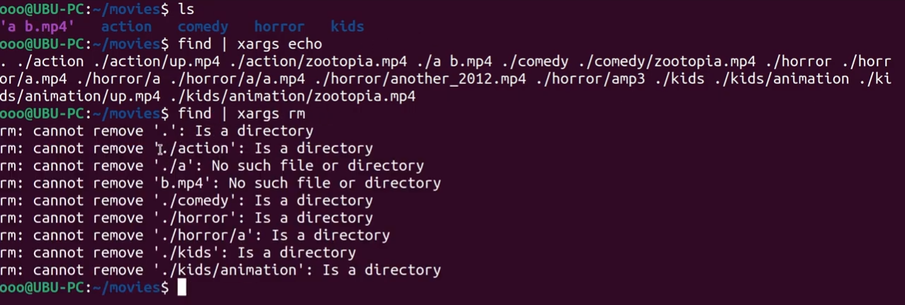

# Basic Linux Commands

## 1. `man`
**Explanation:** Prints the manual of any command.

**Syntax:**
```bash
man <command>
```

## 2. `pwd (Print Working Directory)`
**Explanation:** Prints path of current Directory.

**Syntax:**
```bash
 pwd
```

## 3. `ls`
**Explanation:**  Prints content of current working directory.

**Syntax:**
```bash
 ls
```

**Options:**

* <mark>-a</mark> -> Prints hidden files.

* <mark>- l</mark> -> Prints files in long format and it shows modification time of files.  
Modification means change the file contents .

* <mark>- lc</mark> -> Prints files in long format and it shows change time of files.  
Change means moving files or changing permissions .

* <mark>- lu</mark> -> Prints files in long format and it shows access time of files.  
When file was accessed last time .
* <mark>- h</mark> -> Prints files in human readable file size format.

* <mark>- t</mark> ->Sort  files from newest to oldest.

* <mark>- r</mark> -> Sort files from oldest to newest. 


While Printing content of file with <mark>-a</mark> options there are two files <mark>double dot (..)</mark> and <mark>single dot (.)</mark> .

<mark>Double dot</mark> is a reference of previous directory whereas <mark>Single dot</mark> is a reference of current directory.

## 4. `cd (Change Directory)`
**Explanation:** Changes the directory.

**Syntax:**
```bash
 cd <source> <destination>
```

Root Directory -> Parent Directory is also know as Root Directory . It starts from "**/**".

Home Directory -> Current User files in a specific directory . That is the Home Directory. It starts with "~".

Absolute Path -> Path given in such a way that it start with root.  
**Example :**
```bash
cd /home/gaba31/documents/
```

Relative Path -> Path that is relative from the current directory.  
**Example :**
```bash
cd documents/
```
## 5. `mkdir (Make Directory)`
**Explanation:** Creates a  new  Directory.

**Syntax:**
```bash
 mkdir [Options]... directory...
```
* Whichever thing comes under square brackets [ ] that are optional .   
* . . . means any number of occurence .

**Options:**

* <mark>-p</mark> -> If there is no parent directory it will create it and can add any number of sub directories in it .  

    Example : We are trying to create animation folder inside kids folder but kids folder does not exist then -p option comes under picture and create both the folders.

    ```bash
    mkdir -p kids/animation
    ```


## 6. `touch`
**Explanation:** Creates a new file with given extention . It Update the access and modification times of each FILE to the current time.

**Syntax:**
```bash
 touch [Options]... directory...
```

**Options:**

* <mark>-a</mark> -> Change only access time .  

* <mark>-m</mark> -> Change only modification time .  


## 7. `file`
**Explanation:** It determines the file type based on data which is present inside the file .  
Example : In .mp4 file we write python code ,so it tells the type of file is python.

**Syntax:**
```bash
 file 'a b'                       #Within quote it will treat as single file
```

## 8. `nano`
**Explanation:** Nano is a simple , easy to use text editor that operates within a terminal window . If a file is not there , it creates & open it .

**Syntax:**
```bash
 nano abc.txt
```
### Navigation in nano : 
* Ctrl - O : Write the current file to disk .  
* Ctrl - X : CLose the current file buffer and exit the editor .
* Ctrl + ⬆️ -> Moves cursor to the inital word of the first line .  
* Ctrl + ⬇️ -> Moves cursor to the last line . 
* Ctrl + E -> Moves cursor to the last of the current line .   
* Ctrl + A -> Moves cursor to the start of the current line .  
* Alt + G -> Asks to which line we have to go.  
* Generally we don't use **options** with nano command .

### Basic Editing in nano :
* Ctrl + Shift + C: Copy to global(Windows Keyboard)    
* Ctrl + Shift + V: Paste from global  
* Ctrl-K: Cut a line / selected line   
* Alt + ^: Copy the line / selected
* Ctrl-U: Remove backward line from where the cursor is.  
* Alt + U: Undo 
* Ctrl + W: Search for a string or a regex  
* Ctrl + \\ : Replace a string    
* Alt + B: Skips word backward  
* Alt + F: Skips word forward   
* Ctrl + R : Searches History .
* Ctrl + W : Remove character from cursor to start of that word.
* Ctrl + D : Closes the terminal .

## 9. `rm (Remove)`
**Explanation:** Remove files or directories . It will remove permanently .  

**Syntax:**
```bash
rm [Option] argument 

 rm abc.txt
```

**Options:**

* <mark>-r</mark> -> Deletes non empty directory . 

* <mark>-d</mark> -> Deletes empty directory . 

## 10. `cp (Copy) and mv (Move)`
**Explanation:** Copy or move files or directories . cp command can rename file as well .  

**Syntax:**
```bash
cp source... destination
# For rename
cp source... destination rename
# Same for move .
```

## 11. `cat (Concatenate)`
**Explanation:** : Concatenate files .  

**Syntax:**
```bash
cat [option]... [File]...
cat >a.txt
# Use Ctrl + D at the end , it means end of input .

cat a.txt b.txt > c.txt

cat a.txt b.txt >> c.txt
```

**Options:**  
Both can create file if does not exist .
* <mark>></mark> -> Overites in file.  

* <mark>>></mark> -> Append the file. 

## 12. `echo`
**Explanation:** : Prints text which you will write .  

**Syntax:**
```bash
echo "Hello" 

# We can do this as well

echo "Satish Kumar" > abc.txt
```

## 13. `tac (Concatenate)`
**Explanation:** : Concatenate files but in reverse order.  

**Syntax:**
```bash
tac [option]... [File]...
tact >a.txt
# Use Ctrl + D at the end , it means end of input .

tac a.txt b.txt > c.txt

tac a.txt b.txt >> c.txt
```

**Options:**  
Both can create file if does not exist .
* <mark>></mark> -> Overites in file.  

* <mark>>></mark> -> Append the file. 


## 14. `rev `
**Explanation:** : Reverse line of a file character wise .  

**Syntax:**
```bash
rev fruits.txt
```

## 15. `head and tail`
**Explanation:** : Prints first 10 lines of file . 

**Syntax:**
```bash
head fruits.txt
head -2 fruits.txt #Prints first two lines.

tail fruits.txt

# With -f option it will print first or last files but wait for the new ones to append.

tail -f fruits.txt   # -f option generally used when we are dealing with log files.

```
## 16. `less`
**Explanation:** : Show content of file in a better way then cat .  

**Syntax:**
```bash
less fruits.txt
```

**Options:**  
* <mark>/</mark> -> Can search in file . 

* <mark>< space ></mark> -> Go to next page .

<hr>

#### Important :
When a program or command is executed in the
terminal, it generates output that can be
displayed directly in the terminal window. This
output is known as the standard output.

```bash
ls >> a.txt
# With this it will override standard output in  hello.txt.
ls -z > hello.txt 2> bye.txt

# If any any comes in the command then it will append standard error to the bye.txt and if not then append to hello.txt .
```

**Options:**  
* <mark>1></mark> -> This is by default and used to add standard output in a file. 

* <mark>2></mark> -> If any error in a command then it will append in new file else it will not append .

<hr>


## 17. `sort`
**Explanation:** : sort lines of text files .  

**Syntax:**
```bash
sort [OPTION]... [FILE]...

sort fruits.txt

# Sort in reverse order

sort -r fruits.txt
```

**Options:**  
* <mark>-n</mark> ->For number we can use. 
* <mark>-r</mark> -> Reverse Order .
* <mark>-k</mark> -> Used for Sorting based on specific key.

* <mark>-u</mark> -> Unique Sorted list .

<hr>

#### Important :
When we have to combine multiple commands then we use pipe(|) operator.
First command output will be input for the second command.

```bash
ls -lh | sort -k5h sort_files.txt 

ls -lh | sort -k5h sort_files.txt | tail -5
```

<hr>


## 18. `grep`
**Explanation:** : It prints lines that matches pattern.  

**Syntax:**
```bash
grep <pattern> <file-name>...   # pattern is case sensitive

grep "happy" meditation.txt

sort fruits.txt | grep "mango"
```

**Options:**  
* <mark>-r</mark> -> Search pattern recursively .
* <mark>-i</mark> ->Remove case sensitivity and show all. 
* <mark>-c</mark> -> Return Counts the occurence of pattern .

* <mark>-n</mark> -> Tells in which line pattern matches .
* <mark>-w</mark> -> When to search pattern as an individual word .
* <mark>-B<number></mark> -> Prints match with above n number of lines .
* <mark>-A<number></mark> -> Prints match with below n number of lines .
* <mark>-C<number></mark> -> To combine -B -A options we use -C option .

**We can give regex in grep command.**

<hr>

#### Important :
Ques. How to use Arithmetic operations in linux terminal.  
Ans **Use echo with sub shell () . Refering () as sub - shell .**

```bash
# can add any operator
echo $((3+5))
```
sub shell is used when we don't want to change directory and but still have to open it .

$ sign means we have to write variable or expression after that .

```bash
(cd Downloads/ ; ls) #First it will go to downloads then run ls but still we are in the same directory

(cd Downloads/ || ls) # Behave as OR

(cd Downloads/ && ls) # Behave as &&
```
<hr>

## 19. `Find`
**Explanation:** : It is used to find files in directory using pattern , extention , or name of the file .   
By running find command in a directory without arguments , will list all the files.

**Syntax:**
```bash
find [path...] [extention] #expression can be pattern , extentsion
```

**Options:**  
* <mark>-name</mark> -> It accepts patterns that follow standard shell wildcard characters . find command will try to find in the nested directories as well .
```bash
Example :
file path/to/search -name"filename"

# Wildcard Characters
# " * " -> Matches any string of characters , including an empty string.
# " ? " -> Matches any single characters.
# " [] " -> Matches any one of the enclosed characters. For eg , [abc] matches 'a' ,'b' or 'c'.
# " ! " -> When used as the first character in a pattern , it negates the pattern.
```
* <mark>-i</mark> ->Remove case sensitivity and show all. 
* <mark>-type f </mark> -> Prints only files.

* <mark>-type d</mark> -> Prints only directory .
* <mark>-size +100M</mark> -> Find files based on the size of file .
```bash
find /path -size +100M #for files larger than 100Mb
find /path -size -50k # for files smaller than 50kb
```
* <mark>-mtime -7 </mark> ->Find files modified within a certain time frame.

```bash
find /path -mtime -7 # for files modified in last 7 days
find /path -mtime +7 # for files modified more than 7 days ago
find /path -ctime -7 # for files changed in last 7 days

# a - for access time 
# c - for change time 
# Use min if want to check in min format , by default time checks in days format.
```



### Combining with logical Operator :



* <mark>-empty </mark> ->Find empty files.



```bash
# {} is nothing but a iterator like we do in a loop .

#Example :

find -empty -exec rm -rd {} ';' # This command search for the empty file/folder and then iterate over each empty file and delete it .
```

## 20. `xargs`
**Explanation:** : xargs excutes command in a single time not in a loop like -exec option in find command  .  

**Syntax:**
```bash
find | xargs file
```

**Important** :
While xargs is powerful, it might not handle
special characters and spaces in file names as
gracefully as the -exec option with find, which
has built-in mechanisms to handle these
situations more effectively.

Example :
Here we are trying to remove all files but here limitation of xargs comes in between that it just try to remove all files without spaces. That it is showing **'./a'** is not a file directory.




## 21. `history`
**Explanation:** : Displays history of commands .  

**Syntax:**
```bash
history

history 10 #Last 10 commands

history | head

! <line no in history want to execute> # By this it will execute that line

history -d 465 # Delete's 465 no of history

echo $HISTSIZE #Show's size of history HISTSIZE is an env variable
```

