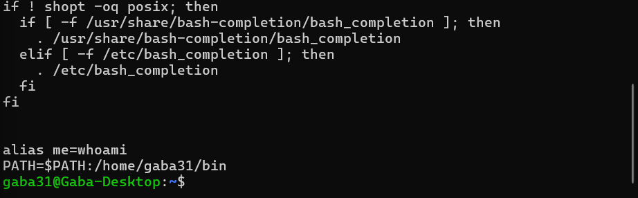

# Linux Permission Commands

By default Ubuntu creates a group of same user-name .  
Example :  As you can see below .


<hr>

## Structure of Permission :
Linux file permissions define who can read, write, or execute a file or directory.

Each file or directory has a 10-character permission string, for example:

```diff
-rwxr-xr--
```

```css
[T][Owner][Group][Others]
```

Breakdown:

1st character (T) → File Type

Next 3 characters → Owner permissions

Next 3 characters → Group permissions

Last 3 characters → Others permissions

Total = 10 characters

### File Type (First Character)  

| Symbol | Meaning       |
| ------ | ------------- |
| `-`    | Regular file  |
| `d`    | Directory     |
| `l`    | Symbolic link |

```css
-rw-r--r--   Regular file
drwxr-xr-x   Directory
lrwxrwxrwx   Symbolic link
```

### Permission Types

**Each permission group contains three characters:**

```bash
rwx
```

| Symbol | Meaning       | Value |
| ------ | ------------- | ----- |
| `r`    | Read          | 4     |
| `w`    | Write         | 2     |
| `x`    | Execute       | 1     |
| `-`    | No permission | 0     |


### Permission Groups

```
rwx   rwx   rwx
│     │     │
│     │     └── Others
│     └──────── Group
└────────────── Owner
```

#### To get into a folder , that folder should have executable ( "x" ) permission on . Otherwise we won't be able to get into that folder .

<hr>


# 1. `chmod (Change Mode)`
**Explanation:** The chmod command is used to change file and directory permissions in Linux.

**Syntax:**

```bash
chmod [options] mode file_name

#Structure 
chmod [who(u,g,o)][what(+,-,=)][which(r,w,x)]
```

* **Numeric (Octal) Mode**  
    In numeric mode, permissions are represented using numbers.

    | Permission  | Value |
    | ----------- | ----- |
    | Read (r)    | 4     |
    | Write (w)   | 2     |
    | Execute (x) | 1     |

    Add values together for each group:

    ```bash
    rwx = 4 + 2 + 1 = 7
    r-x = 4 + 0 + 1 = 5
    r-- = 4 + 0 + 0 = 4
    ```

* **Symbolic Mode**   
Symbolic mode uses letters to modify permissions.  

    | Symbol | Meaning      |
    | ------ | ------------ |
    | u      | User (Owner) |
    | g      | Group        |
    | o      | Others       |
    | a      | All (u+g+o)  |


    Operator 

    | Symbol | Meaning              |
    | ------ | -------------------- |
    | +      | Add permission       |
    | -      | Remove permission    |
    | =      | Set exact permission |


    Excute permission to user : 
    ```bash
    chmod u+x file.txt
    ```

    Remove permission from group :
    ```bash
    chmod g-w file.txt
    ```

    Give read permission to others :
    ```bash
    chmod o+r file.txt
    ```

    Set exact permission
    ```bash
    chmod u=rwx,g=rx,o=r file.txt
    ```

# 2. `su`
**Explanation:** run a command with substitute user and group ID.  

**Syntax:**

```bash
su - username
``` 

Practical Usecase -> For security reason's we create a newuser and do work in that because the newuser won't have the admin permissions . So it is safe option .


# 3. `sudo addgroup groupname` 
**Explanation:** Creates a new group . Group or add user to a group can be done by root user.  
**Syntax:**
```bash
sudo addgroup backend

sudo adduser username backend
``` 

# 4. `Nested Session` 
**Explanation:** Opening a terminal creates a new session every time or we can say for every user a session id is created every time.  
**Syntax:**

```bash
# To check session id
echo $$

# To open nested session type
#By this a new session will be created inside a session .
bash

``` 
# 5. `chown (Change Ownership)`
Explanation:
The chown command is used to change the owner (user) and/or group of a file or directory in Linux.

Only root or users with sudo privileges can change ownership.

**Syntax:**
```bash
# By this it can change permission of both owner and group
chown [options] owner[:group] file_name

# Change owner
sudo chown alice file.txt

# Change group only
sudo chown :groupname file.txt
sudo chown :backend file.txt

#Change Both Owner and Group
sudo chown username:groupname file.txt
sudo chown alice:backend file.txt

#Change Ownership Recursively
sudo chown -R username:groupname directory_name
# By this it will change owner and group permission in nested directroy also.
sudo chown -R alice:backend project/
```

🔹 **Important Notes**

* Only root/sudo can change ownership.

* Normal users can change group ownership only if they belong to that group.

* chown does NOT change permissions — use chmod for that.

# 6. `Shell`
**Syntax:**
```bash
# By this it will give in which session we are on .
echo $$

# Each shell store some info during that session and those info are called env variables. Can access by :

printenv

printenv USER #print only that variable

# How to add varibles in the script

export my_mail=mail123@mail.com
```

### A shell is a command-line interface (CLI) that allows users to interact with an operating system by typing commands.It serves as a mediator between the user and the operating system, enabling users to run programs, manage files, configure system settings, and perform various other tasks.

### Shells also support scripting, allowing users to write scripts (sequences of commands) to automate tasks.

### There are several types of shells, and they can be broadly categorized into two main groups: Unix-like shells and Windows shells .

### Unix like Shells :

* **Bourne Shell (sh)**: The Bourne Shell was one of the earliest Unix shells and served as the basis for
many subsequent shells. It provides basic functionality and is often used for scripting.

* **Bash (Bourne Again SHell)**: Bash is the default shell for many Unix-like operating systems, including
Linux and macOS. It extends the capabilities of the original Bourne Shell and incorporates features
from other shells like the Korn Shell and the C Shell.

* **Korn Shell (ksh)**: The Korn Shell was developed by David Korn as an enhancement to the Bourne
Shell. It includes features from both the Bourne Shell and the C Shell, making it a powerful and user-
friendly shell.

* **C Shell (csh)**: The C Shell has a syntax that is somewhat C-like and was developed to provide
interactive features not present in the original Bourne Shell. Its successor, tcsh, is an improved
version with additional features.

* **Zsh (Z Shell)**: Zsh is an extended shell that incorporates features from bash, ksh, and tcsh. It includes
advanced scripting capabilities and interactive features for users.


### Windows Shell:
* **Command Prompt** (cmd.exe): The Command Prompt is the
traditional command-line interface for Windows. While it lacks some
advanced features found in Unix-like shells, it provides a basic
command-line environment.

* **PowerShell**: PowerShell is a more recent and powerful shell for
Windows. It is designed for automation and task scripting, with a
focus on managing system components through a command-line
interface.

<hr>

# `What is Path?`

When we write pwd in our bash shell it print path of curr working directory but when we try to run custom command let say "hi" it does work.

It throws error -> Command 'hi' not found.

This is because we have not add the script to a directory in the Path.

### What is Path?

#### The PATH variable contains a list of directories (sepeated by " : " ) where the shell looks for executable files.

When we type ls , shell looks for exe file in the path directories.  

```bash
which pwd  #print path of this script in Path

source hi  #executes in current shell with source
```

### How to add custom script in PATH ?

#### In .bashrc file do this :



<hr>

# `What is a Script ?`

In Linux, a script is a series of commands
written in a scripting language (like Bash)
that can be executed by the shell.

## `What is Bash ?`

Bash is both a command-line interpreter (shell) and a scripting language .

## `Creating a script using bash :`

```bash
#!/bin/bash     # Here this line is called as shebang
echo "Hello , Linux Scripting!"
```

When you execute a script, the system typically
relies on the shebang (the #!/bin/bash line at the
beginning of the script) to determine the
interpreter that should be used, regardless of the
file extension. This allows you to name your
scripts with or without a .sh extension.

## `How to execute this script ?`

```bash
bash myFirstScript   #This explicitly tells the Bash shell to execute the script. It's commonly used for Bash scripts.

sh myFirstScript   # This instructs the system to use the default shell.

source myFirstScript  # This runs the script in the current shell session instead of spawning a new process. It's often used to execute scripts that modify the environment, such as setting environment variables.

./myFirstScript  #Requires the script to be made executable If the file is found and has execute permission, the shell executes it using the appropriate interpreter specified in the shebang line. We can give absolute path also intead of writting like this.


# bash and sh run files in sub shell means parent shell won't affect but incase of source it open in the parent shell only and if any changes happens that will also happen in current shell also .
```

### What if you want to run a script as if it were a command, without specifying the path to the script every time.

#### Ans - Add that file in path like we did previously


<hr>

## `What are cron jobs ?`

For Scheduling task and to run them periodically after fixed intervals (weekly,daily,hourly) , So these schdule task are known as cron jobs .
Each user haa its own file where schdeule task is written .

```bash
crontab -e   # For editing schdule tasks
```

---

```
* * * * * command_to_execute
| | | | |
| | | | +---- Day of Week (0-6) [Sunday=0]
| | | +------ Month (1-12)
| | +-------- Day of Month (1-31)
| +---------- Hour (0-23)
+------------ Minute (0-59)
```

---

## Special Characters

| Symbol | Meaning |
|---------|---------|
| `*` | Every value |
| `,` | Multiple values |
| `-` | Range |
| `/` | Step values |

---

## Special Characters

| Symbol | Meaning |
|---------|---------|
| `*` | Every value |
| `,` | Multiple values |
| `-` | Range |
| `/` | Step values |

---

## Common Cron Examples

### Run every minute
```
* * * * * command
```

### Run every day at midnight
```
0 0 * * * command
```

### Run daily at 2:30 AM
```
30 2 * * * command
```

### Run every hour
```
0 * * * * command
```

### Run every Sunday at 6 AM
```
0 6 * * 0 command
```

### Run every 10 minutes
```
*/10 * * * * command
```

### Run on 1st day of every month
```
0 0 1 * * command
```

---

## Managing Cron Jobs

### Edit cron jobs
```
crontab -e
```

### List cron jobs
```
crontab -l
```

### Remove cron jobs
```
crontab -r
```
