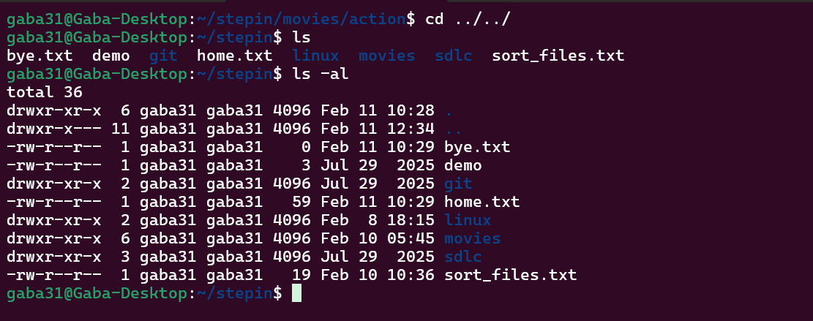

# Linux Permission Commands

By default Ubuntu creates a group of same user-name .  
Example :  As you can see below .



<hr>

## Structure of Permission :
Linux file permissions define who can read, write, or execute a file or directory.

Each file or directory has a 10-character permission string, for example:

```diff
-rwxr-xr--
```

```css
[T][Owner][Group][Others]
```

Breakdown:

1st character (T) → File Type

Next 3 characters → Owner permissions

Next 3 characters → Group permissions

Last 3 characters → Others permissions

Total = 10 characters

### File Type (First Character)  

| Symbol | Meaning       |
| ------ | ------------- |
| `-`    | Regular file  |
| `d`    | Directory     |
| `l`    | Symbolic link |

```css
-rw-r--r--   Regular file
drwxr-xr-x   Directory
lrwxrwxrwx   Symbolic link
```

### Permission Types

**Each permission group contains three characters:**

```bash
rwx
```

| Symbol | Meaning       | Value |
| ------ | ------------- | ----- |
| `r`    | Read          | 4     |
| `w`    | Write         | 2     |
| `x`    | Execute       | 1     |
| `-`    | No permission | 0     |


### Permission Groups

```
rwx   rwx   rwx
│     │     │
│     │     └── Others
│     └──────── Group
└────────────── Owner
```

#### To get into a folder , that folder should have executable ( "x" ) permission on . Otherwise we won't be able to get into that folder .

<hr>


# 1. `chmod (Change Mode)`
**Explanation:** The chmod command is used to change file and directory permissions in Linux.

```bash
chmod [options] mode file_name

#Structure 
chmod [who(u,g,o)][what(+,-,=)][which(r,w,x)]
```

* **Numeric (Octal) Mode**  
    In numeric mode, permissions are represented using numbers.

    | Permission  | Value |
    | ----------- | ----- |
    | Read (r)    | 4     |
    | Write (w)   | 2     |
    | Execute (x) | 1     |

    Add values together for each group:

    ```bash
    rwx = 4 + 2 + 1 = 7
    r-x = 4 + 0 + 1 = 5
    r-- = 4 + 0 + 0 = 4
    ```

* **Symbolic Mode**   
Symbolic mode uses letters to modify permissions.  

    | Symbol | Meaning      |
    | ------ | ------------ |
    | u      | User (Owner) |
    | g      | Group        |
    | o      | Others       |
    | a      | All (u+g+o)  |


    Operator 

    | Symbol | Meaning              |
    | ------ | -------------------- |
    | +      | Add permission       |
    | -      | Remove permission    |
    | =      | Set exact permission |


    Excute permission to user : 
    ```bash
    chmod u+x file.txt
    ```

    Remove permission from group :
    ```bash
    chmod g-w file.txt
    ```

    Give read permission to others :
    ```bash
    chmod o+r file.txt
    ```

    Set exact permission
    ```bash
    chmod u=rwx,g=rx,o=r file.txt
    ```

# 2. su 
**Explanation:** run a command with substitute user and group ID.

```bash
su - username
``` 

Practical Usecase -> For security reason's we create a newuser and do work in that because the newuser won't have the admin permissions . So it is safe option .


# 3. sudo addgroup groupname 
**Explanation:** Creates a new group . Group or add user to a group can be done by root user.

```bash
sudo addgroup backend

sudo adduser username backend
``` 

# 3. Nested Session 
**Explanation:** Opening a terminal creates a new session every time or we can say for every user a session id is created every time.

```bash
# To check session id
echo $$

# To open nested session type
bash

#By this a new session will be created inside a session .
``` 