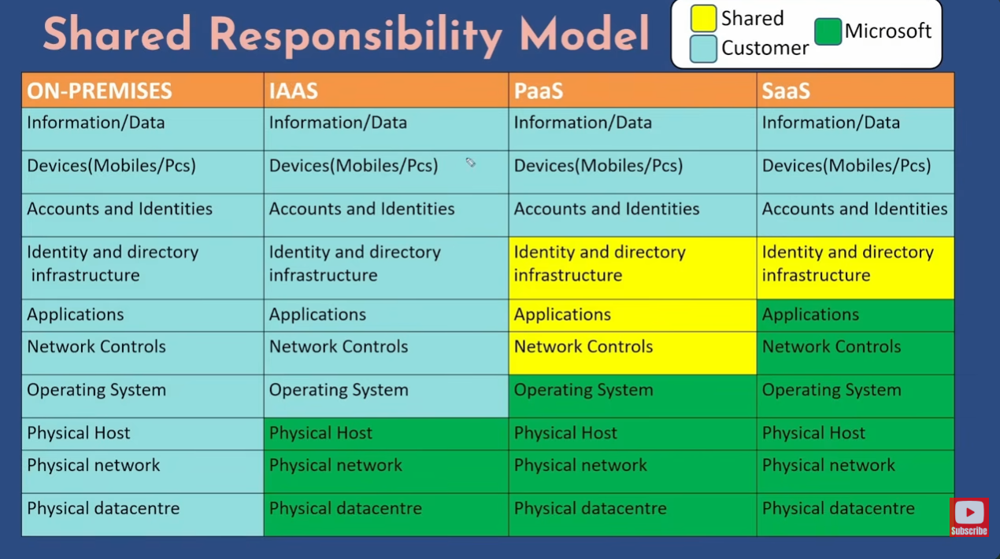

# Basics of cloud computing :

## `For understanding cloud computing first we need to know why do we actually need it ?`

#### Ans -> Imagine you are the owner of ***IT Firm*** and you want to scale your buisness.

However you would need a large no of resources to that expansion possible . Such as -  office space , more hardware , more people to manage and a lot of money for everything.

These are one time upfront expenses which are known as high capex (**Capital Expenditure**).

Then you would also have some reccuring expenses . Such as cost of regular Hardware maintainance , salaries to employees , electricity bill for office , monthly building rentals and so on .

These reccuring operation expenses are also known as opex (**Operating Expenditure**).

These are nothing but the roadblocks for this expansion and your goal is minimize your capex and opex and build a system that is -

* **Highly Scalable**

* **Highly Available**

* **Fault Tolerant**

* **System with built in security**

* **High Performance**

<!-- <hr> -->

## `What is cloud computing ?`
#### Cloud computing is a way to access these resources and services over the internet . Instead of buying and managing by yourself.

#### Imagine that you need to run a software program to store large amount files. Instead of buying this hard disk drive you rent a storage service such AWS S3 or Azure service or Google cloud platfrom(GCP) storage and it will provide you the access where you can store your files and make use of it remotely.

#### So buying hardware is old school. Renting everything is cloud computing all about .


| Aspect | IaaS (Infrastructure as a Service) | PaaS (Platform as a Service) | SaaS (Software as a Service) |
|---|---|---|---|
| Description | Provides full control over infrastructure resources such as virtual machines and storage. ( You can rent these resources from a cloud provider and configure them as needed to run your own application ) | Provides a runtime environment and platform to deploy applications along with development tools. (You do not get access to the underlying OS . You get access to their env in which you can deploy your application and start using it ) | Provides ready-to-use applications accessible to end users. These software application are hosted and run by cloud provider you just use them as user . |
| Admin Responsibility | Customer must handle admin tasks such as patching, upgrades, and backups.Patching is nothing but making sure all your softwares and OS packages are up to date and have all the fixes of security and vulnerability . | Platform provider handles admin tasks, including automated backups. | Provider handles all admin tasks. |
| Pricing / Examples | Pay-per-use model. Examples: EC2, Azure VM, GCE. | Pay-per-service model. Example: Azure Web App. | Subscription-based model. Examples: Office 365, Gmail, Dropbox. |
| Ideal Use Case | Suitable for lift-and-shift migration and legacy applications.Lift and shift migration is nothing but to move your application on premises to the cloud infrastructure so that you get benifits of cloud but you do not want to make any changes to your application . | Ideal when customers prefer not to manage infrastructure admin tasks. Ideally useful for focuses on application deployment and start using it . | Ideal when customers want to use standard cloud applications without managing infrastructure. |
| Level of Control | Highest control over infrastructure. | Moderate control focused on application deployment. | Least control; focus only on using the software. |

<hr>


### When you want full control of OS then we use IAAS and when we don't want to take care of Admin task then go with PAAS or SAAS .

### For going from on premises to cloud IAAS would be ideal choice because you get full control over your OS and can customize your application as you need .

<hr>

## `Shared Responsibility Model .`

### It is an agrement between customer and microsoft . Certain are taken care by microsoft and some by customer and some are shared among both parties .



<hr>

## `Difference b/w Public , Private and Hybrid clouds ?`

| Aspect | Public Cloud | Private Cloud | Hybrid Cloud |
|---|---|---|---|
| Description | Resources are shared among multiple users, and customers pay only for the resources they use. Example : Azure, GCP and many more .| Resources are dedicated to a single organization, providing greater control and security. They own datacenters and help customer to host on their datacenter. | Combines both public and private clouds in an interconnected environment. |
| Ownership / Operation | Hosted and operated by third-party cloud providers such as AWS, Azure, or GCP. | Operated and maintained by a single organization, either on-premises or in a data center. | Organizations use both environments and decide which workloads run in public or private clouds. |
| Security & Control | Lower control compared to private cloud but managed by providers with shared infrastructure. | Higher control and security since infrastructure is dedicated. | Provides an extra layer of flexibility and security by keeping sensitive workloads private while using public resources when needed. |
| Capital Expenditure (CapEx) | No major upfront capital expense required to scale. | High capital expenditure required. | Allows optimization of spending by mixing private infrastructure with scalable public resources. |
| Resource Scaling | Resources can be provisioned or decommissioned on demand. | Hardware must be purchased and installed before you start using the services . | Resources can be added on demand by scaling workloads in the public cloud. |
| Example | Public Bus . Taking a bus where other people will share a ride with you . You don't have to worry about physical maintainance or capex , you only pay when you ride the bus . | Own Car. Driving your own car first which is a capex and you are responsible for its maintainance and you get more control over it. |Taking Public Bus for work and using private car for personal use .|

<hr>

## `Benifits of using cloud computing :`

* **High Availability and Fault Tolerance** -> It means that your application is designed and configured to be availabe even if there is an hardware of software failure and will always be responding to the customer and traffic .

    **Example 1** : Let say user is accessing an app (accesing through load balancer or DNS) but for simplicity called as APP which has two backend server VM1 and VM2 and these servers are connected to master DB and another one is slave database (Read Only) , data is replicated syncronously in both of the database . It is designed is such a way even if there is a VM failure application will still be able to repond back to the customer using VM2. When VM2 shuts down then load on VM1 will automatically increases and to avoid VM1 to crash we can put them inside VMSS (VM Scale Set). It has a template so whenever there is a failure let say VM2 goes down using this template over here VMSS will provission a new VM . Now App will list to VM1 and VM3. VMSS make sure we always have 2 instances listning to app frontend .

    ```mermaid
    flowchart 

        U[User] --> APP[Application / Load Balancer]

        APP --> VM1[VM1]
        APP --> VM2[VM2]

        VM1 --> DB1[(DB1 - Primary)]
        VM2 --> DB2[(DB2 - Replica)]

        DB1 <-- Replication --> DB2

        VM1 -. Failover .-> VM2
    ```

* **Scalabity** -> The ability of system to adjust according to the demand . 

    **Example 1** : Let say user is accessing an app and connected to one backend server VM1 . Today let say there is no load on server right now , hence whenever you access the application it is able to get the response back from the app .

    But as soon as user count increases and all are trying to access at same time then the server will be on high load means high CPU and memory utilization.

    In this scenario App will crash and let to bad customer experience which will affect revenue .

    ```mermaid
    flowchart LR
    U1[User]
    U2[User]
    U3[User]
    U4[User]

    U1 --> APP[Application]
    U2 --> APP
    U3 --> APP
    U4 --> APP

    APP --> VM1[Backend Server VM1]

    VM1 --> LOAD[High Load = High CPU & Memory Usage]
    ```

    ### Summary:
    - Multiple users access the application simultaneously.
    - Application routes all traffic to a single backend server.
    - VM1 becomes overloaded.
    - CPU and memory usage increase.
    - Application performance degrades or crashes.


    #### It can be fixed by either vertical Scalling or horizontal scaling . Replacing existing infra with bigger infrastructure . When there will be vertical scaling there will be downtime which customer will face when switching to higher infra .The time b/w switching from one infra to another is nothing but downtime .So we can't do vertical scalling 10 times a day and that way it is not feasible solution .

    #### But with horizontal scalling it can be fixed because there will be multiple VM's like VM1,VM2,VM3 and uses according to their need and that's why it is preferred more over Vertical Scalling . Eg for my reference -> like some car has functionallity to shifts from 4 cylinder to 2 cylinder when they require less power something like that concept works here .

* **Elasticity** -> Similar to Scalablity . Elasticity happens automatically , instead of someone manually scalling up or scalling down on the system there should be a mechnism like in AWS we have Aurus scaling groups wwhich takes care of this feature . In Azure it is done by VM Scale Set and in GCP , it is done by Instance Groups . These all services makes sure , system will be able to scale more or less based on the demand .

* **Cost Effectiveness** -> Two important concepts :  
    * Pricing Calculator -> We can estimate the price of Azure services like let say you need to have a VM , 12gb memory and 80gb of HDD and us central1 and all the features like availability , performance etc and based on that this pricing calculator will provide you an estimated cost . 

    * Total cost of ownership -> It will give you an estimate cost and tell you how much you will save when you will shift from on premises to cloud.You will get a summary report .

    <hr>

    