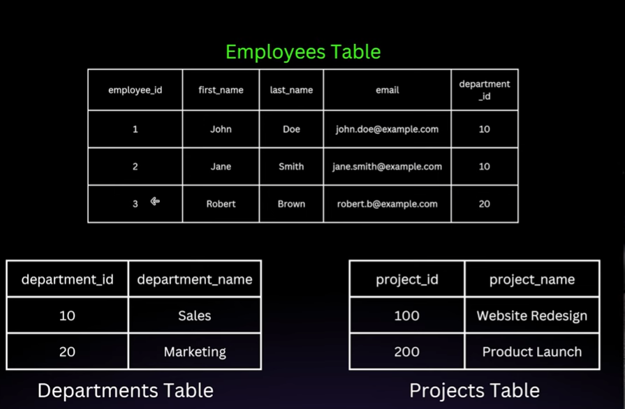

# `What is a Database ?`
### A database is an organized collection of structured information, or data, typically stored electronically in a computer system. Databases allow for data to be easily accessed, managed, modified, updated, and deleted.

### They serve as the backbone of various applications-everything from social media platforms to e-commerce websites and financial systems rely on databases to store user profiles, products, transactions, and more.

## `Key Characterstrics of DataBases :`
1. **Persistent Storage**: Data is stored over the long term, surviving application
restarts and system reboots.

2. **Structured and Organized**: Data is systematically arranged to avoid duplication
and inconsistency.

3. **Easily Retrievable**: Efficient methods exist for querying, filtering, and retrieving
stored data quickly.
Multiple users and applications can use the database

4. **Concurrent Access**:
simultaneously without corrupting data.

5. **Security and Integrity**: Access can be controlled and data can be protected
against unauthorized use or corruption.
Eg . You are in a team and your manager has given you only read writes of the database when he will be satisfied with your performance and know that you are reliable then he will give crenditals of update as well .

## `Why Use a Database?`
1. To maintain a permanent record of information.

2. To ensure data integrity and reduce redundancy(duplicacy).

3. To efficiently handle large volumes of data and ensure fast retrieval.

4. To allow multiple users and applications to access and work with the data safely and concurrently.

5. To back up and recover data in case of hardware failures
or data corruption.

## `What is Database Management Systems (DBMS) ?`

### It is software that manages databases, handling data storage, retrieval, updates, and security. It acts as an interface between databases and users/applications.

#### Examples of DBMS :
1. Relational DBMS (RDBMS) : MySQL, PostgreSQL, Oracle, SQL Server . Stores data in a structured format (tables).
2. NoSQL DBMS : MongoDB, Cassandra, DynamoDB . Stores data in unstructured format (JSON).
3. In-memory DBMS : Redis, Memcached . Stores data in ram for faster retrievals , access etc.

#### Relational Data Model : The relational data model organizes data into one or more tables (also known as relations) with rows and columns. The idea, introduced by E.F. Codd in 1970, revolutionized how databases are structured and queried.

## `Key Concepts in the Relational Model`
• Tables (Relations): A table represents an entity or a concept. For example,
Employees, Customers, Products. Each table consists of rows and columns.

• Columns (Attributes): Columns define the type of data stored. For example,
in an Employees table, you might have columns like employee_id, first_name,
last_name, hire_date.AII rows in the same column share the same type and
meaning of data.

• Rows (Records): Each row in a table represents a single instance or record.
For example, one row in the Employees table would represent one specific
employee.

• Keys: Primary Key & Foreign Key

• Relationships Between Tables:
1:1, & M:M & 1:M

### Let's take real world example to understand these concepts :
#### Imagine a small company that needs to store data about employees, departments, and projects.

#### One question can come in your mind that why we have taken dept_id in main table we can have dept instead of this :

#### Let's say you have now 1 lakh employees and you want to change sales dept name to Buisness Developement , we can't go for each record and update sales to BD . Another thing that here we have only dept_id , let's say we have more column in employees table which have info related to dept like head_count , budget etc . So if we want to change any one col for one dept , for that we have to look for each dept then what value to change . It is not possible , time consuming . Instead of that we will create seperate table for that and do change there which is a best practice .

**Primary Key**: A column or set of columns that uniquely identify each row
in a table. For instance, employee_id can be a primary key if it uniquely
identifies every employee.

**Foreign Key**: A column in one table that refers to the primary key in
another table. For example, a department_id in the Employees table that
references the department_id in a Departments table.

**One-to-One (1:1)**: Each row in Table A is related to exactly one row
in Table B. For example, one employee might have one unique
company car assigned.

**One-to-Many (1:M)**: One row in Table A can be associated with
multiple rows in Table B. For example, one department can have
many employees.

**Many-to-Many (M:M)**: Multiple rows in Table A can be associated
with multiple rows in Table B. For example, employees can work on
multiple projects, and projects can have multiple employees.

## `Why the Relational Model?`
* Data Integrity: By using primary and foreign keys, the relational
model enforces referential integrity. This means no orphaned
records should exist (e.g., an employee record that refers to a
department that doesn't exist).

* Reduced Redundancy: Through a process called normalization,
relational databases are designed to minimize duplication and
maintain consistent data.

* Flexibility in Querying: Structured Query Language (SQL) provides
a powerful, declarative way to retrieve and manipulate data in
complex ways without changing the database design.