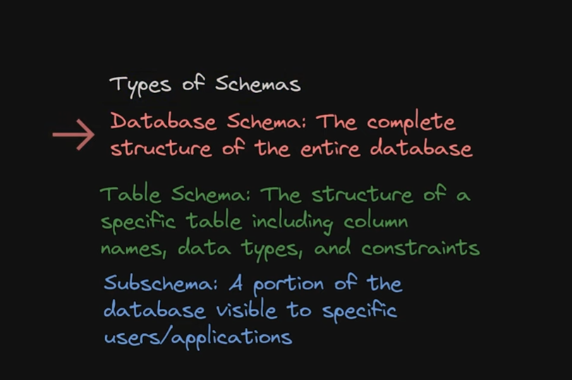
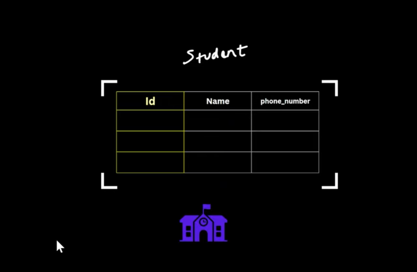
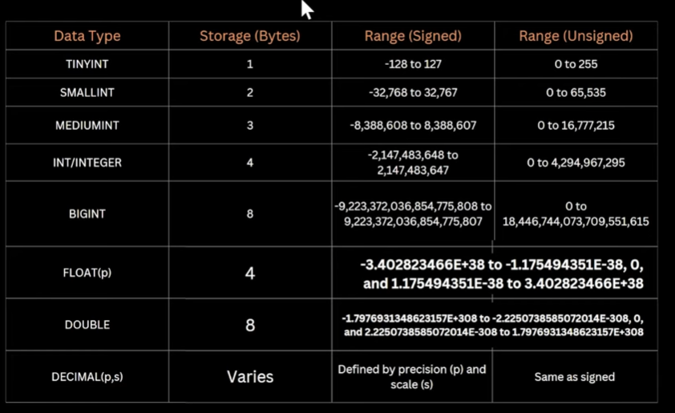
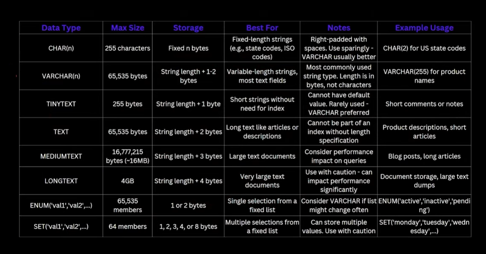
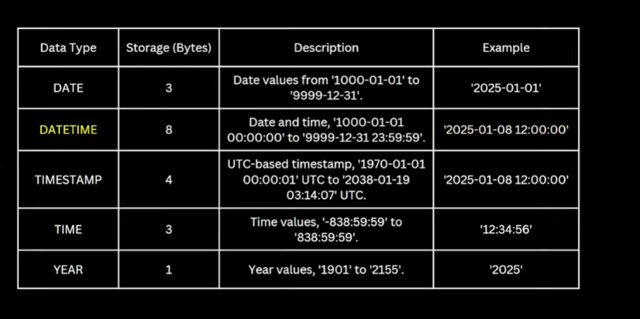

## `What is a schema ?`
### Schema is the logical blueprint or structure that defines how data is stored within a database .

**It decides:**  
1. The tables in the database.
2. The relationship between those tables.
3. The attribute(columns) within each table.
4. The constraint and rules that govern the data.
5. The datatype for each field.

## Types of Schema :

* Database Schema is nothing but top view of database , basically tells us which tables will be there in database and how they are interlinked with each other .

* Table Schema tells us info about a specific table as the name suggest like which type of data we are storing in a table.

* Subschema is kind of view . For eg . Hospital database . It will have patient info , billing info , doctors info in diff diff tables . Now we want to show only patient table and doctor table to a doctor without their phone no . So the result that we will show is nothing but subschema.

## Data Types 

### For eg we are creating a database for school in which we will have a Student table which will have id , name , ph_no . So what data type we will use for them . Let's see .

1. Number Data Type 
* Integer Type -> We all know . Eg . Till BIGINT in the given photo .
* Floating Type -> Which can be changed like 1.2 x 10^2 can be written as 0.12 x 10^3 . Eg. Float and Double are eg . of Floating data type .
* Fixed Type  -> Like in finance we take of each paisa too . Eg 50.54 . So .54 is also important . Eg. DECIMAL(total,precision) in the below photo.

2. String Data Type 
* For MySQL TEXT types, the inline storage threshold is 768 bytes after this size, the data moves to separate pages
while keeping a pointer in the table row . Varchar can do fully-indexing whereas in TEXT datatype we can do only prefix indexing .

3. Date and DateTime Data Type 
* DateTime stores the given time whereas Timestamp stores given time in UTC but when some one retrieves the data the time will be shown according to the UTC . 
* UTC stands for Coordinated universal time .

4. Binary Data Type
* Binary(n) 
* VarBinary(n)
* To store keys or hash data we use Binary and VarBinary
* To store files we use the below Data Types
* TINY BLOB -> 255 bytes
* BLOB -> 64kb
* MEDIUM BLOB -> 16mb
* LONG BLOB -> 4GB